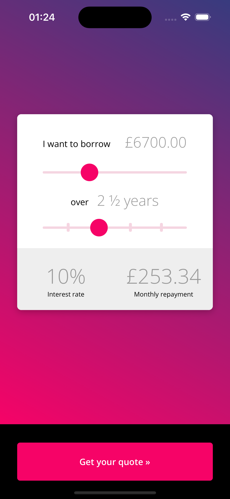
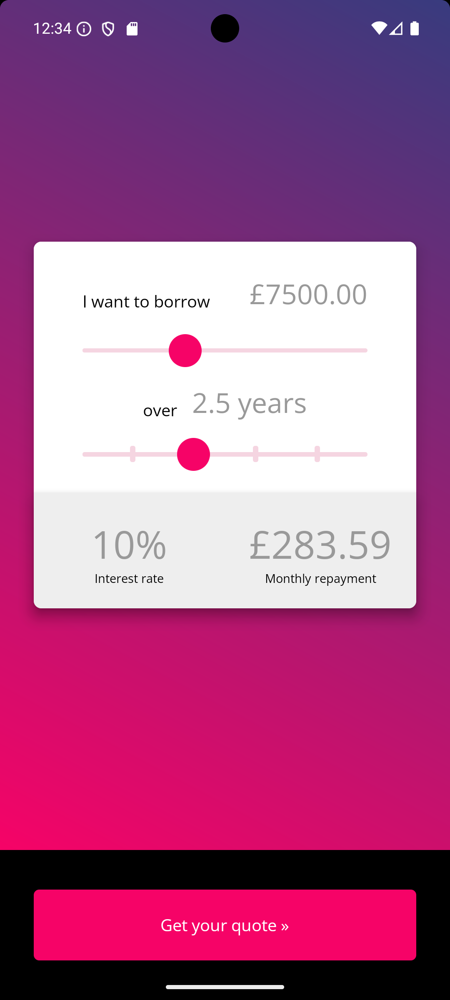

# Lendable Loan Calculator

A React Native loan calculator application that calculates monthly repayments with dynamic interest rates based on loan amount. Built with TypeScript for type safety and comprehensive test coverage.

---

## Demo

### iOS Version

<div align="center">
  <table>
    <tr>
      <td align="center">
        
        <br />
        <em>Screenshot</em>
      </td>
      <td align="center">
        
https://github.com/user-attachments/assets/your-ios-video.mp4

<br />
        <em>Video Demo</em>
      </td>
    </tr>
  </table>
</div>

### Android Version

<div align="center">
  <table>
    <tr>
      <td align="center">
        
        <br />
        <em>Screenshot</em>
      </td>
      <td align="center">
        
https://github.com/user-attachments/assets/your-android-video.mp4

<br />
        <em>Video Demo</em>
      </td>
    </tr>
  </table>
</div>

> **Note:** To add demo videos, record your app (see `demos/README.md`), then edit this README on GitHub and drag/drop your video files where the placeholder URLs are shown above.

---

## Features

- **Loan Amount Slider**: £1,000 - £20,000 in £100 increments
- **Loan Term Slider**: 1 - 5 years in 6-month steps (displays decimal format: 2.5 years)
- **Dynamic Interest Rates**: Automatically adjusts based on loan amount tier
- **Monthly Repayment Calculation**: Uses standard amortization formula
- **Real-time Updates**: Instant calculation as sliders change
- **iOS & Android**: Cross-platform support
- **Modern UI**: Beautiful gradient background with card-based layout

### Interest Rate Tiers

| Amount Borrowed | Interest Rate |
|----------------|---------------|
| £1,000-£4,999  | 5%            |
| £5,000-£9,999  | 10%           |
| £10,000-£14,999| 15%           |
| £15,000-£20,000| 20%           |

---

## Installation

### Prerequisites
- Node.js (v20+)
- Yarn
- Xcode (for iOS)
- Android Studio (for Android)

### Setup

```bash
# Install dependencies
yarn install

# iOS Setup (Mac only)
cd ios && pod install && cd ..
```

---

## Running the App

```bash
# Start Metro Bundler
yarn start

# Run on iOS
yarn ios

# Run on Android
yarn android
```

---

## Testing

### Running Tests

```bash
# Run all tests
yarn test

# Run tests in watch mode
yarn test -- --watch

# Run tests with coverage report
yarn test -- --coverage
```

### Test Coverage

**📊 Comprehensive Test Suite:**
- **Total Tests:** 98 tests across 6 test suites
- **Code Coverage:** 94.73% statements, 100% branches
- **Test Framework:** Jest with @testing-library/react-native

**Coverage by Module:**
- ✅ **Components:** 100% coverage (AmountSlider, YearsSlider, ResultBox, ActionButton)
- ✅ **Utilities:** 100% coverage (calculations.ts)
- ✅ **Constants:** 100% coverage
- ✅ **Styles:** 100% coverage
- ✅ **App.tsx:** 80% coverage

**Test Types:**
- Unit tests for all components
- Integration tests for main App
- Edge case and boundary testing
- Real-world loan scenario testing
- Snapshot testing

---

## Project Structure

```
lenablecalculator/
├── App.tsx                    # Main app component (TypeScript)
├── src/
│   ├── components/            # UI components (TypeScript)
│   │   ├── AmountSlider.tsx   # Loan amount selector
│   │   ├── YearsSlider.tsx    # Loan term selector
│   │   ├── ResultBox.tsx      # Results display
│   │   ├── ActionButton.tsx   # CTA button
│   │   └── index.js           # Component exports
│   ├── constants/
│   │   └── index.ts           # App constants (TypeScript with interfaces)
│   ├── utils/
│   │   └── calculations.ts    # Loan calculations (TypeScript)
│   ├── styles/
│   │   └── theme.js           # Centralized styling
│   └── assets/
│       └── fonts/             # OpenSans font family
├── __tests__/
│   ├── components/
│   │   ├── AmountSlider.test.js    # 14 tests
│   │   ├── YearsSlider.test.js     # 14 tests
│   │   ├── ResultBox.test.js       # 20 tests
│   │   └── ActionButton.test.js    # 8 tests
│   ├── utils/
│   │   └── calculations.test.js    # 21 tests
│   └── App.test.js                 # 21 integration tests
├── jest.config.js             # Jest configuration
├── jest.setup.js              # Test setup and mocks
└── tsconfig.json              # TypeScript configuration
```

---

## Technical Implementation

### Loan Calculation Formula

Standard amortization formula:
```
M = P × [r(1 + r)^n] / [(1 + r)^n - 1]

where:
  M = Monthly Payment
  P = Principal (loan amount)
  r = Monthly interest rate (annual ÷ 12 ÷ 100)
  n = Number of payments (years × 12)
```

### Architecture Decisions

- **Fully TypeScript**: Main app and all components use TypeScript
- **Component-based**: Modular, reusable components with typed props
- **Type-safe utilities**: All calculations and helpers fully typed
- **Centralized constants**: Type-safe configuration with interfaces
- **Pure functions**: Testable, predictable calculation utilities
- **Theme system**: Consistent styling throughout
- **Modern testing**: @testing-library/react-native for user-centric tests

### Dynamic Interest Rate Calculation

Interest rate automatically calculates based on loan amount:
```typescript
export const calculateInterestRate = (amount: number): number => {
  if (amount >= 1000 && amount <= 4999) return 5;
  if (amount >= 5000 && amount <= 9999) return 10;
  if (amount >= 10000 && amount <= 14999) return 15;
  if (amount >= 15000 && amount <= 20000) return 20;
  return 10; // Default fallback
};
```

### State Management

- React hooks (`useState`, `useEffect`)
- Automatic recalculation on amount or term change
- Derived state for interest rate
- Type-safe state updates with TypeScript

---

## Dependencies

### Core
- `react`: 19.1.0
- `react-native`: 0.81.4
- `typescript`: ^5.8.3

### UI
- `react-native-linear-gradient`: ^2.8.3
- `react-native-sliders`: ^2.0.2

### Testing
- `jest`: ^29.6.3
- `@testing-library/react-native`: ^13.3.3
- `@types/jest`: ^29.5.13
- `@types/react`: ^19.1.0

---

## Technology Stack

### TypeScript Implementation
**TypeScript is used for:**
- ✅ Main App component (`App.tsx` with React.FC)
- ✅ All UI components (`*.tsx` with typed props and interfaces)
- ✅ Core utilities (`calculations.ts` with full type annotations)
- ✅ Constants (`index.ts` with interfaces and type exports)

**JavaScript is used for:**
- Styling (`theme.js` - style objects don't require types)
- Tests (`*.test.js` - simpler test syntax)
- Configuration files

**Benefits:**
- Type safety for all business logic
- Better IDE support and autocomplete
- Catch errors at compile time
- Self-documenting code through types
- Easier refactoring

### Testing Strategy

**Modern Testing Library:**
- Migrated from deprecated `ReactTestRenderer.create`
- Using `@testing-library/react-native` for user-centric testing
- Query elements by text, role, and user-visible attributes
- Better error messages and debugging

**Test Organization:**
- Separate test file for each component
- Grouped by functionality using `describe` blocks
- Clear, descriptive test names
- Edge cases and boundary testing included

**Coverage Configuration:**
- Automatic coverage collection available
- HTML reports generated in `coverage/` directory
- Thresholds set at 80% for all metrics
- Currently exceeding all thresholds (94%+ coverage)

---

## Design Compliance

✅ Gradient background (blue to teal)  
✅ White card with shadow elevation  
✅ Two interactive sliders with visual feedback  
✅ Results display with clear labels  
✅ Prominent action button  
✅ OpenSans font family  
✅ Professional color scheme  
✅ Responsive layout

---

## Development Workflow

```bash
# Install dependencies
yarn install

# Run tests during development
yarn test -- --watch

# Check test coverage
yarn test -- --coverage

# Lint code
yarn lint

# Start development server
yarn start

# Run on device/simulator
yarn ios    # or yarn android
```

---

## Code Quality

- ✅ 98 comprehensive tests
- ✅ 94%+ code coverage
- ✅ TypeScript for type safety
- ✅ ESLint configuration
- ✅ Modern testing practices
- ✅ Component-based architecture
- ✅ Separation of concerns
- ✅ Reusable, maintainable code

---

## License

MIT
